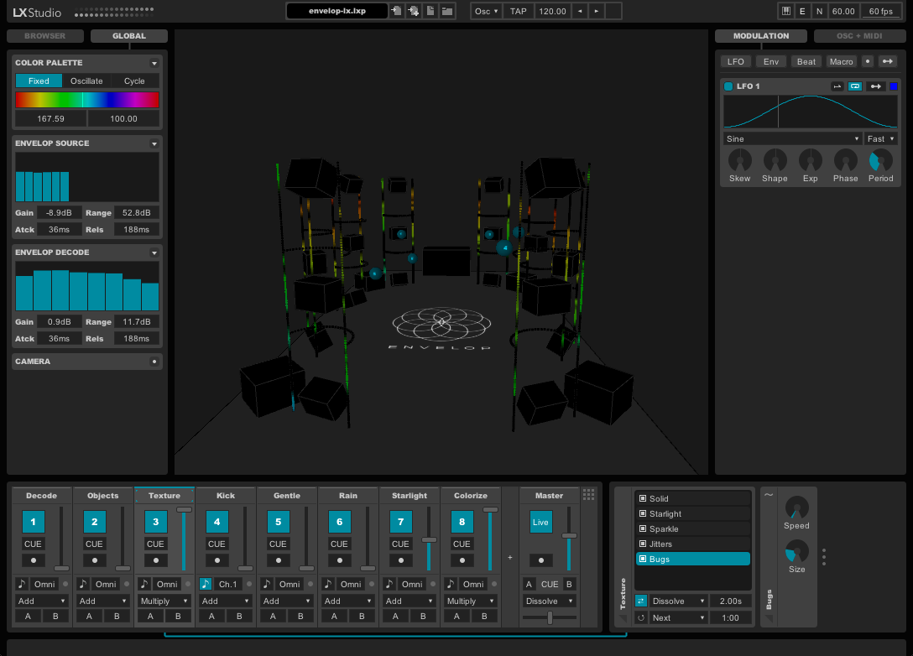

# EnvelopLX
EnvelopLX is an interactive lighting application for [Envelop](http://www.envelop.us/). It runs in Processing, built on top of the open source [P3LX](https://github.com/heronarts/P3LX) framework. The system may be controlled directly, or via remote OSC control from the [Envelop for Live](https://github.com/EnvelopSound/EnvelopForLive) devices, which can be composed and sequenced from Ableton.

When connected with an active Envelop server, real-time spatial audio feedback is also available.

## Installation

- Download and install [Processing 3 &rarr;](https://processing.org/download/?processing)
- Download or clone this repository into your Processing sketchbook folder
- Open EnvelopLX and run the sketch

## Future Development

- TouchOSC support will be coming soon

